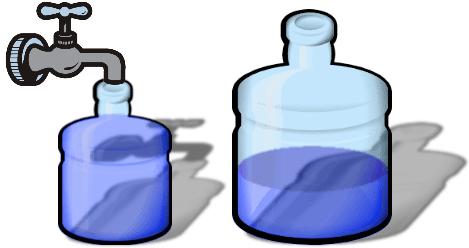

# Introdução à Inteligência Artificial - PEE / 2 - Formulação[¶](#Introdução-à-Inteligência-Artificial---PEE-/-2---Formulação)

# Guião Laboratorial[¶](#Guião-Laboratorial)

(7/Out:11/Out-2019)

## Revisão[¶](#Revisão)

Vamos formular mais um problema através do Paradigma do Espaço de Estados, usando o Python e a ferramanta [aima-python].

Note que formular neste caso, quer dizer construir uma programa em Python.

Recordando, para formularmos um problema de acordo com esta metododologia, precisamos de:

*   **Estados**: Idealizar uma representação para o que vamos considerar um estado. Notem que o estado deve ser mínimo, apenas deve conter a informação que muda com as acções;
*   **Estado Inicial**: Identificar o estado inicial;
*   **Objectivo**: Verificar se um estado satisfaz o objectivo, sendo assim, um dos estados finais;
*   **Acções**: Para cada estado, caracterizar rigorosamente as acções de mudança de estado, de que modo incrementam os custos dos caminhos, e quais os estados resultantes.

## Recursos necessários[¶](#Recursos-necessários)

*   Para executar as experiências que se seguem, copie o módulo [searchPlus.py](searchPlus.py) para a directoria de trabalho.
*   Copie para o mesmo local os outros módulos auxiliares necessários: [utils.py](utils.py)
*   Crie um novo modulo **pee2.py** para ir realizando as experiências sugeridas ou então pode usar a versão notebook deste ficheiro.

In [ ]:

<pre>from searchPlus import *
</pre>

### O problema dos Jarros[¶](#O-problema-dos-Jarros)

Recordando o enunciado: Imagine que tem dois jarros com capacidade para 3 e 5 litros. Pretende-se medir 4 litros de vinho, usando as seguintes operações: encher um jarro, esvaziar um jarro, ou verter vinho de um jarro para outro.

#### Representação dos estados[¶](#Representação-dos-estados)

Podemos definir um tuplo com o líquido em cada um dos jarros. É essa a informação que muda com as acções. A capacidade dos jarros deve ficar no problema, e informação estática. O tuplo que colcaremos no problema referente às capacidades dos jarros tem de respeitar a mesma ordem do estado.

Na verdade, podemos avançar já para a definição da classe do Problema, fazendo notar que podemos ter mais do que 2 jarros.

In [ ]:

<pre>class ProblemaJarros(Problem):
    """Problem about pouring water between jugs to achieve some water level.
 Each state is a tuples of water levels. In the initialization, also provide a tuple of
 jug sizes, e.g. PourProblem(initial=(0, 0), goal=4, sizes=(5, 3)),
 which means two jugs of sizes 5 and 3, initially both empty, with the goal
 of getting a level of 4 in either jug."""

    def __init__(self,initial=(0,0),goal=4,capacidades=(3,5)):
        super().__init__(initial,goal)
        self.capacidades = capacidades

    def actions(self, estado):
        """As acções executáveis neste estado."""
        jarros = range(len(estado))
        return ([('Enche', i+1)    for i in jarros if estado[i] < self.capacidades[i]] +
                [('Esvazia', i+1)    for i in jarros if estado[i]] +
                [('Verte', i+1, j+1) for i in jarros if estado[i] for j in jarros if i != j])

    def result(self, estado, accao):
        """O estado sofre accao e passa a ser:."""
        resultado = list(estado)  # converte tuplo em lista
        a, i, *_ = accao
        i = i-1  # O jarro i correspoinde à posição i - 1
        if a == 'Enche':   # Enche jarro i até capacidade
            resultado[i] = self.capacidades[i]
        elif a == 'Esvazia': # Esvazia i
            resultado[i] = 0
        elif a == 'Verte': # Verte i em j
            j = accao[2]-1  # o jarro j corresponde à posição j - 1
            quantidade = min(estado[i], self.capacidades[j] - estado[j])
            resultado[i] -= quantidade
            resultado[j] += quantidade
        return tuple(resultado)

    def is_goal(self, estado):
        """True if the goal level is in any one of the jugs."""
        return self.goal in estado
</pre>

Vamos criar um problema

In [ ]:

<pre>p = ProblemaJarros()
</pre>

Vamos agora criar uma instância deste problema, imprimir o estado inicial e perguntar quantos litros desejamos medir.

In [ ]:

<pre>prob_jarros = ProblemaJarros()
print("Estado Inicial:",prob_jarros.initial)
print('Capacidades dos jarros:',prob_jarros.capacidades)
print("O objectivo é medir ",prob_jarros.goal, "litros")
</pre>

Vamos verificar quais são as acções que podemos aplicar ao estado inicial

In [ ]:

<pre>prob_jarros.actions(prob_jarros.initial)
</pre>

Vamos encher o jarro 2 (a primeira acção) e obter um novo estado...

In [ ]:

<pre>e1 = prob_jarros.result(prob_jarros.initial,('Enche', 1))
print(e1)
</pre>

In [ ]:

<pre>prob_jarros.actions(e1)
</pre>

Vamos verter o segundo jarro no primeiro...

In [ ]:

<pre>e2 = prob_jarros.result(e1,('Verte',1,2))
print(e2)
</pre>

Vamos agora reencher o 1º jarro

In [ ]:

<pre>e3 = prob_jarros.result(e2,('Enche',1))
print(e3)
</pre>

Vamos testar a função **_path_cost_** que é herdada de **Problem**. Notem que essa função recebe 4 argumentos: o custo actual, o estado, a acção e o novo estado e devolve o novo custo acumulado: custo actual + o custo da transição entre estados, neste caso 1. Começamos com 0 no estado inicial.

In [ ]:

<pre>custo = 0
e0 = prob_jarros.initial
print("Comecemos:",e0,", com custo =",custo)
e1 = prob_jarros.result(e0,('Enche',2))
custo = prob_jarros.path_cost(custo,prob_jarros.initial,('Enche',2),e1)
print("Vamos encher o segundo jarro:",e1, ", com custo =",custo)
e2 = prob_jarros.result(e1,('Verte',2,1))
custo = prob_jarros.path_cost(custo,prob_jarros.initial,('Verte',2,1),e1)
print("Vamos verter o jarro 2 em jarro 1:",e2, ", com custo =",custo)
</pre>

#### Exercício1[¶](#Exercício1)

Experimente resolver outras instâncias deste problema. Por exemplo:

*   Como medir 3 litros com recipientes de 7 e 5
*   Como medir 6 litros com recipientes de 7, 8 e 3

#### Exercício 2[¶](#Exercício-2)

Crie uma função **_exec()_** que pegue num estado e execute uma sequência de acções numa lista, devolvendo o estado resultante.

#### Exercício 3[¶](#Exercício-3)

Reformule o problema dos jarros, a versão verde, de modo a que o custo das acções deixe de ser unitário. Queremos calcular a água gasta da torneira até à medição desejada - enchem-se os jarros da torneira. Assim, apenas tem custo a acção de encher e o custo corresponde à água gasta.

#### Exercício 4[¶](#Exercício-4)

Complete a formulação esboçada a seguir do problema do puzzle de 8.

Estamos perante o problema clássico de um puzzle de peças deslizantes onde se pode deslocar qualquer peça ortogonalmente para a casa vazia. Partimos de uma configuração inicial (por exemplo, o puzzle da esquerda da figura) e queremos atingir a configuração objectivo (puzzle da direita).

<pre>class PuzzleN(Problem):
    """ O problema das N=dxd-1 peças deslizantes, num tabuleiro quadrado de dimensão dxd
 onde um dos quadrados está vazio, tentando atingir uma configuração particular
 Um estado é representado por um tuplo de dimensão dxd.
 As peças são representadas pelos próprios números e a peça vazia por 0.
 O objectivo por omissão no caso de 3x3:
 1 2 3
 4 5 6 ==> (1, 2, 3, 4, 5, 6, 7, 8, 0)
 7 8 _
 Existe um atributo d que representa a dimensão do quadrado, 3 no caso do puzzle de 8
 """

    def __init__(self, initial, goal=(0, 1, 2, 3, 4, 5, 6, 7, 8)):
        self.initial, self.goal = initial, goal
        self.d = int(math.sqrt(len(initial)))

    def display(self, state):
        """ print the state please"""
        output=""
        for i in range(self.d * self.d):
            ch = str(state[i])
            if ch == "0":
                ch = '_'
            output += ch + " "
            i = i+1
            if i % self.d == 0:
                output += "\n"
        print(output)
</pre>

#### Exercício 5[¶](#Exercício-5)

Formule o problema das latas (nº 22 da [folha de exercícios de formulação](1819IIA_Exercicios_PEE_formulacao.pdf) ).

Temos uma colecção de N objectos de tamanhos S1, … , SN. Queremos colocar estes objectos em latas de capacidade B e queremos usar o menor número de latas possível. Por exemplo, suponha que temos:  
– B=100  
– 4 objectos com os tamanhos seguintes:  
S1=45, S2=80, S3=30 e S4=15.  
Então é possível colocar estes 4 objectos em duas latas, colocando por exemplo os objectos 1, 3 e 4 numa das latas e o objecto 2 noutra. Uma solução alternativa consiste em empacotar os objectos 1 e 3 numa das latas e os objectos 2 e 4 noutra.

